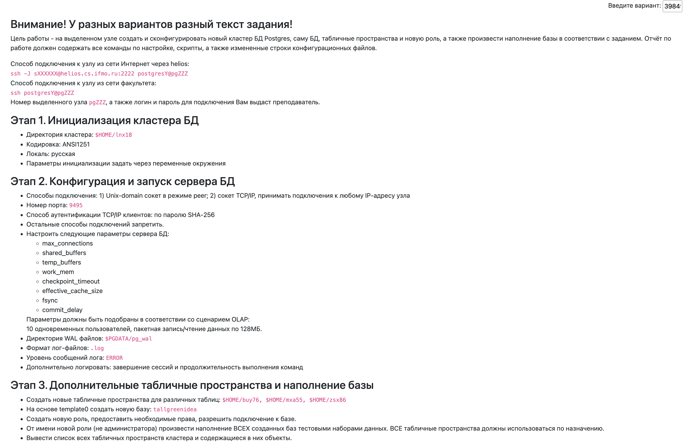

# dbms-lab-2

`variant 398495`



Цель работы - на выделенном узле создать и сконфигурировать новый кластер БД Postgres, саму БД, табличные пространства и
новую роль, а также произвести наполнение базы в соответствии с заданием. Отчёт по работе должен содержать все команды
по настройке, скрипты, а также измененные строки конфигурационных файлов.

Способ подключения к узлу из сети Интернет через helios:

`ssh -J sXXXXXX@helios.cs.ifmo.ru:2222 postgresY@pgZZZ`

Способ подключения к узлу из сети факультета:
`ssh postgresY@pgZZZ`

Номер выделенного узла `pgZZZ`, а также логин и пароль для подключения Вам выдаст преподаватель.

## Этап 1. Инициализация кластера БД

<ul>
<li>Директория кластера: $HOME/lnx18</li>
<li>Кодировка: ANSI1251</li>
<li>Локаль: русская</li>
<li>Параметры инициализации задать через переменные окружения</li>
</ul>

## Этап 2. Конфигурация и запуск сервера БД
<ul>
    <li>Способы подключения: 1) Unix-domain сокет в режиме peer; 2) сокет TCP/IP, принимать подключения к любому IP-адресу узла</li>
    <li>Номер порта: 9495</li>
    <li>Способ аутентификации TCP/IP клиентов: по паролю SHA-256</li>
    <li>Остальные способы подключений запретить.</li>
    <li>
        Настроить следующие параметры сервера БД:
        <ul>
            <li>max_connections</li>
            <li>shared_buffers</li>
            <li>temp_buffers</li>
            <li>work_mem</li>
            <li>checkpoint_timeout</li>
            <li>effective_cache_size</li>
            <li>fsync</li>
            <li>commit_delay</li>
        </ul>
    </li>
    Параметры должны быть подобраны в соответствии со сценарием OLAP:
    10 одновременных пользователей, пакетная запись/чтение данных по 128МБ.

<li>Директория WAL файлов: $PGDATA/pg_wal</li>
<li>Формат лог-файлов: .log</li>
<li>Уровень сообщений лога: ERROR</li>
<li>Дополнительно логировать: завершение сессий и продолжительность выполнения команд</li>
</ul>

## Этап 3. Дополнительные табличные пространства и наполнение базы
<ul>
<li>Создать новые табличные пространства для различных таблиц: $HOME/buy76, $HOME/mxa55, $HOME/zsx86</li>
<li>На основе template0 создать новую базу: tallgreenidea</li>
<li>Создать новую роль, предоставить необходимые права, разрешить подключение к базе.</li>
<li>От имени новой роли (не администратора) произвести наполнение ВСЕХ созданных баз тестовыми наборами данных. ВСЕ табличные пространства должны использоваться по назначению.</li>
<li>Вывести список всех табличных пространств кластера и содержащиеся в них объекты.</li>
</ul>

# Выполнение 
## Этап 1. Инициализация кластера БД

### Подключение к выделенному узлу (узел pg178, пользователь postgres1):

```bash
s368991@helios.cs.ifmo.ru:2222 postgres1@pg178
```
### Создание директории кластера:

```bash
mkdir -p $HOME/lnx18
```
### Создаем переменные окружения 
```bash
vim ~/.bashrc

export LANG=ru_RU.ANSI1251
export LC_COLLATE=ru_RU.ANSI1251
export LC_CTYPE=ru_RU.ANSI1251
export LANG=ru_RU.UTF-8
```
### Инициализируем кластер 
```bash
initdb -D $HOME/lnx18
```
### Очищение каталога
```bash
rm -rf $HOME/lnx18/*
```
### Запуск сервера
```bash
pg_ctl -D $HOME/lnx18 start
```

## Этап 2. Конфигурация и запуск сервера БД
### - Способы подключения: 1) Unix-domain сокет в режиме peer; 2) сокет TCP/IP, принимать подключения к любому IP-адресу узла
### - Номер порта: 9495
### Способ аутентификации TCP/IP клиентов: по паролю SHA-256
### Остальные способы подключений запретить.
#### Настройка pg_hba.conf
```bash
vi $HOME/lnx18/pg_hba.conf
```
```vim
# TYPE  DATABASE        USER            ADDRESS                 METHOD

# Unix-domain сокеты (peer-аутентификация)
local   all             all                                     peer

# TCP/IP соединения (SHA-256 аутентификация)
host    all             all             0.0.0.0/0               scram-sha-256
host    all             all             ::/0                    scram-sha-256

# Отключение всех остальных подключений
# IPv4
host    all             all             127.0.0.1/32            reject
# IPv6
host    all             all             ::1/128                 reject
```
#### Настройка postgresql.conf
```bash
vi $HOME/lnx18/postgresql.conf
```
```vim
# Разрешение подключения через TCP/IP
listen_addresses = '*'          # Принимать подключения с любого IP-адреса
port = 9495

# Аутентификация по паролю с использованием SCRAM-SHA-256
password_encryption = scram-sha-256   # Включаем SCRAM-SHA-256 для паролей

# Рекомендуемые параметры для безопасности
ssl = off                       # (если SSL не используется)
```


[//]: # ()
[//]: # (```bash)

[//]: # (psql -p 9555 -d postgres)

[//]: # (```)

[//]: # ()
[//]: # (### Создайте базу на основе template0:)

[//]: # (```bash)

[//]: # (createdb -T template0 tallgreenidea)

[//]: # (```)

[//]: # (### Создайте новую роль:)

[//]: # (```bash)

[//]: # (create role test_user with login password 'test_user';)

[//]: # (```)

[//]: # (### Предоставьте права новой роли:)

[//]: # (```postgresql)

[//]: # (grant all privileges on database tallgreenidea to test_user;)

[//]: # (```)

[//]: # (### )

[//]: # (```postgresql)

[//]: # (psql -p 9495 -h pg178 -d tallgreenidea -U test_user)

[//]: # (```)


